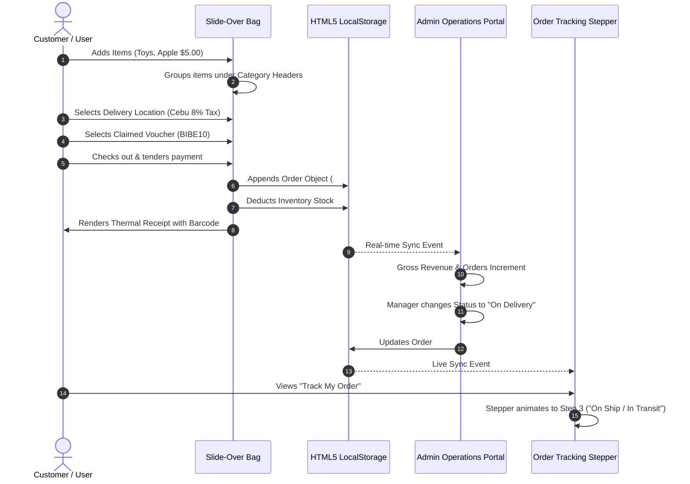

# IT 101: Introduction to Computing — Final Project Documentation
**Project Title:** Bibe Market Point of Sale (POS) and Marketing Information System  
**Track:** AI-Assisted Information System Development  

---

## TABLE OF CONTENTS
1. [PART I: Software Development Process Documentation (25 Points)](#part-i-software-development-process-documentation-25-points)
   - [1. Problem Identification & Context](#1-problem-identification--context)
   - [2. System Planning & Requirements](#2-system-planning--requirements)
   - [3. Architectural Design & Data Flow](#3-architectural-design--data-flow)
   - [4. AI-Assisted Development Journey & Sample Prompts](#4-ai-assisted-development-journey--sample-prompts)
   - [5. Problems Encountered & Revisions](#5-problems-encountered--revisions)
   - [6. Testing & Quality Assurance](#6-testing--qa-results)
2. [PART II: The Product — System Feature Manual (25 Points)](#part-ii-the-product--system-feature-manual-25-points)
3. [PART III: Individual Reflection Paper Guide (50 Points)](#part-iii-individual-reflection-paper-guide-50-points)

---

# PART I: Software Development Process Documentation (25 Points)

### 1. Problem Identification & Context
Small neighborhood grocery stores and artisanal kiosks (such as our model business, **Bibe Market**) frequently face major operational bottlenecks:
1. **Inefficient Pen-and-Paper Logging:** Cashiers make calculation errors, struggle to apply promotional vouchers, and cannot compute location-based regional taxes accurately.
2. **Lack of Order Transparency & Tracking:** Customers want to know if their order is being prepared, packed, or is already on delivery ("on ship").
3. **Disorganized Cart & Checkout:** Traditional carts lump items together, making it difficult to verify department totals (e.g. distinguishing fresh produce from bakery and toys).
4. **Zero-Database Hosting Constraints:** For an academic submission, hosting must be 100% reliable and free on **GitHub Pages**, which only hosts static files without SQL or Node server support.

**The Solution:** Develop a boutique, editorial-grade Information System powered by **HTML5 LocalStorage**, featuring:
- A landing page with featured carousel and claimable voucher wallet.
- A store catalog with left-hand filtering (Categories including **Toys & Fun**, Price, and Availability).
- A slide-over cart drawer that **groups purchases by their Category header**.
- **Location-based dynamic tax computation** based on delivery city.
- A **4-step animated order tracking timeline**.
- An **Admin Operations Portal** where managers can change order status (e.g., mark as "On Delivery / Shipped") and monitor real-time sales revenue.

---

### 2. System Planning & Requirements

| User Role | Feature Requirements | Technical Implementation |
| :--- | :--- | :--- |
| **Customer / Cashier** | Browse landing page, popular carousel, & filter catalog | DOM rendering, category filter radios, price bounds, sorting |
| **Customer / Cashier** | Add items (e.g. Toys, Fruits, Bread) to Cart | Reactive state with stock depletion checks |
| **Customer / Cashier** | View Bag grouped with Category Headers | Categorized dictionary grouping in `renderDrawer()` |
| **Customer / Cashier** | Location-based tax calculation | Regional tax table with dynamic mathematical formula |
| **Customer / Cashier** | Claim vouchers and apply to orders | Voucher wallet in `UserProfile` & dropdown selector |
| **Customer / Cashier** | Track order status with 4-step stepper | Dynamic progress bar (`0%` ➔ `33%` ➔ `66%` ➔ `100%`) |
| **Admin / Manager** | Live Dashboard KPIs (Revenue, Orders, Units, AOV) | LocalStorage aggregated analytics |
| **Admin / Manager** | Orders Ledger & Shipping Status Management | Dropdown in table updating order status in real-time |
| **Admin / Manager** | Inventory CRUD (Toys, Produce, Bakery, etc.) | Stock counters, "+10 Restock", Add/Edit modals |
| **Admin / Manager** | Marketing (Announcement banner & Vouchers) | Dynamic banner persistence & voucher CRUD |

---

### 3. Architectural Design & Data Flow

#### Real-Time Order Flow & Status Synchronization

---

### 4. AI-Assisted Development Journey & Sample Prompts

1. **Prompt for Editorial Design & Toys Category:**  
   *"Enhance Bibe Market with an editorial boutique look matching high-end lifestyle stores. Add a Toys department (rubber duck, plushie, wooden train, yo-yo), a landing page with hero banner and popular items slider, and about us."*  
   *AI Decision:* Implemented `styles.css` with Google Fonts (`Playfair Display`, `Outfit`, `Inter`), forest green and blush pink palette, and popular favorites carousel.

2. **Prompt for Grouped Cart & Dynamic Location Taxes:**  
   *"In the cart, group items under their category header. Also add location-based dynamic taxes where the rate depends on the customer's city."*  
   *AI Decision:* Created dictionary grouping in `AppCart.renderDrawer()` and regional tax engine (`DEFAULT_LOCATIONS`) updating order totals dynamically.

3. **Prompt for Order Tracking & Admin Shipping Status:**  
   *"Add an order tracking stepper for users (Order Placed -> Packed -> On Delivery -> Delivered). Let the admin update order status like putting it on ship."*  
   *AI Decision:* Built a visual 4-step animated timeline stepper and an interactive status `<select>` in the Admin sales table.

---

### 5. Problems Encountered & Revisions

| Challenge Encountered | Root Cause | AI-Assisted Solution |
| :--- | :--- | :--- |
| **Cart Category Separation** | Products in cart were previously a single flat list. | Re-architected cart rendering to group items into a dictionary mapped by category key, injecting distinct category headers with department emojis. |
| **Location Tax Accuracy** | Tax rates vary depending on customer location. | Implemented a location configuration table with regional tax percentages (3%–12%) and applied tax to `(subtotal - discount)`. |
| **Real-Time Delivery Tracking** | Customer needs to see if their parcel is on ship. | Connected the 4-step stepper with the order's `status` field, updated by the admin in real-time. |
| **Clean Thermal Receipt Printing** | Browser print previews printed web background and navigation bars. | Refined `@media print` CSS so all headers and buttons are hidden, isolating only the thermal receipt paper. |

---

### 6. Testing & QA Results

| Test Case | Steps Executed | Expected Output | Actual Result |
| :--- | :--- | :--- | :--- |
| **TC-01: Toys in Catalog** | Filter by "Toys & Fun". | Displays Yellow Rubber Bibe, Plushie, Train, Yo-Yo. | ✅ PASSED |
| **TC-02: Grouped Cart** | Add 1 Apple and 1 Plushie Toy to bag. | Bag displays separate headers: "🧸 Toys & Fun" and "🍎 Fruits & Veggies". | ✅ PASSED |
| **TC-03: Dynamic Tax** | Select "Metro Manila (12%)" vs "Baguio (3%)". | Tax recalculates immediately based on percentage. | ✅ PASSED |
| **TC-04: Claim Voucher** | Click "Claim Voucher" on `BIBE10`. | Voucher is saved to profile and appears in cart voucher dropdown. | ✅ PASSED |
| **TC-05: Admin Shipping** | Change Order #BM-xxxx from "Processing" to "On Delivery". | Order status updates in Admin and advances timeline in Track Order. | ✅ PASSED |

---

# PART II: The Product — System Feature Manual (25 Points)

1. **Landing Page:** Hero banner, review rating, popular carousel, claimable voucher cards, and about us section.
2. **Store Catalog (Left Filters, Right Products):** Live search, department filters, price filters, in-stock toggle, and sorting.
3. **Slide-Over Bag (Grouped by Category):** Opens via bag button; organizes items under department banners.
4. **Voucher & Dynamic Tax Calculator:** Claim vouchers to profile wallet and apply on order; dynamic location tax computation.
5. **Checkout & Printable Receipt:** Validates payment method, computes cash change, and prints thermal receipt with barcode.
6. **Track My Order Stepper:** 4-step visual tracker (Placed ➔ Packed ➔ On Delivery ➔ Delivered).
7. **Admin Portal:** Live KPIs, Sales ledger with order status updater, inventory stock manager, and demo data generator.

---

# PART III: Individual Reflection Paper Guide (50 Points)

### Suggested Title:
**"Engineering Modern Information Systems with Artificial Intelligence: The Bibe Market Case Study"**

### Outline for Student Paper:
1. **Introduction:** Definition of an Information System in IT 101. Objectives of Bibe Market (streamlining retail operations, eliminating manual logging).
2. **Core IS Components in Bibe Market:**
   - *Input:* Customer selections, claimed vouchers, delivery addresses, tendered cash.
   - *Processing:* Category grouping, voucher discounting, location tax arithmetic, stock depletion.
   - *Storage:* Persistent browser `localStorage` simulating relational data tables.
   - *Output:* Thermal receipts, live delivery timeline, administrative KPIs, exported CSV spreadsheets.
3. **The Role of AI in Software Engineering:** How AI acted as a pair programmer for UX architecture, CSS layout matching, and real-time state synchronization.
4. **Technical Insights & Overcoming Limitations:** Solving static hosting limitations on GitHub Pages using client-side data persistence.
5. **Conclusion:** Reflections on AI ethics, computing fundamentals, and future applications.
